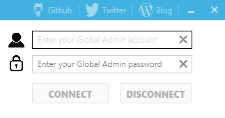

# O365 Data Retriever

## Summary
The tool will extract some data from Office 365 by using PowerShell cmdlets in the background.

At this point in time, the tool **will likely not be suitable** for large tenants.  
The retrieval and display of the data may take longer than expected, but improving the performance is a top priority! We're working on it!


## Pre-requisites

The tool is using / needs the following to run successfully.

### Modules
* [Microsoft Azure AD Module for Windows PowerShell](https://docs.microsoft.com/en-us/office365/enterprise/powershell/connect-to-office-365-powershell#connect-with-the-microsoft-azure-active-directory-module-for-windows-powershell) _(Msol cmdlets)_  
_Right now, we are _**not**_ using the [Azure AD PowerShell for Graph](https://docs.microsoft.com/en-gb/powershell/azure/active-directory/install-adv2?view=azureadps-2.0) module, but we will gradualy make the transition to the AzureAD cmdlets, and this will be communicated in due course._
* [Microsoft Online Services Sign-In Assistant](https://www.microsoft.com/en-us/download/details.aspx?id=41950)
* [SharePoint Online Management Shell](https://www.microsoft.com/en-us/download/details.aspx?id=35588) module  
_We are **not** currently using SharePoint PowerShell PnP, but that will be coming soon to enhance the tool!_
* [Skype for Business Online](https://www.microsoft.com/en-us/download/details.aspx?id=39366) module
* [Microsoft Teams](https://www.powershellgallery.com/packages/MicrosoftTeams/) module


### Permissions
* The tool should be used by Office 365 _**Global Admins**_.  
_Further enhancements will surely make it available for other admins (EXO, SPO, etc...), and this will be communicated in due time._

* The _Execution Policy_ can be set to **"Unrestricted"** or **"RemoteSigned"** for release 0.1.1.  
_This is an important subject, and if you are not able to change the policy for security reasons, we completely understand. We will work on it as soon as possible._

* Skype for Business Online **will** require the _**WinRM service**_ to be started. Therefore, the tool _will attempt_ to start this service if it's not.

* Multi-Factor Authentication _(MFA)_ is **not** yet supported, but actively working on it.


### Software
This tool has only been tested on Windows 10 at this point time.  
If you use PowerShell regularly to manage your Office 365 tenant, then you should be good to go. If not, have a look at the [common issues](https://docs.microsoft.com/en-us/office365/enterprise/powershell/connect-to-office-365-powershell#how-do-you-know-this-worked).


## Which files do I need for the tool to work?

For the tool to run correctly, you need the following:

* **Assemblies** folder  
_This folder contains all the .dll necessary for the tool_

* **Images** folder  
_This folder contains a few images used in the tool_

* **MainWindow.xaml** file  
_This file contains all the elements for the graphical part_

* **O365DataRetriever.ps1** file  
_This file contains the PowerShell script with bindings to the xaml file_


## How do I launch the tool?

1. Download the necessary files and folders _(see above)_ to a location of your choice.


2. Open a PowerShell window _(console or ISE)_ with admin rights, and navigate to this location.

3. Launch the tool by running ```.\O365DataRetriever.ps1```


4. Once the tool is visible, on the top right corner, enter your O365 Global Admin account + password, then click on "Connect" _(or press "Enter" on your keyboard)_



5. Wait for a few seconds for the data to be _retrieved_ and _displayed_.


## Having issues with the instructions?
Please go to the [Report Issues](https://github.com/VeronicaGeek/O365-Data-Retriever-Tool/issues) page, or use the [@veronicageek](https://twitter.com/veronicageek) / [@O365DataR](https://twitter.com/O365DataR) accounts on Twitter for the time being.

 _**Remember though, always be respectful please.**_
 